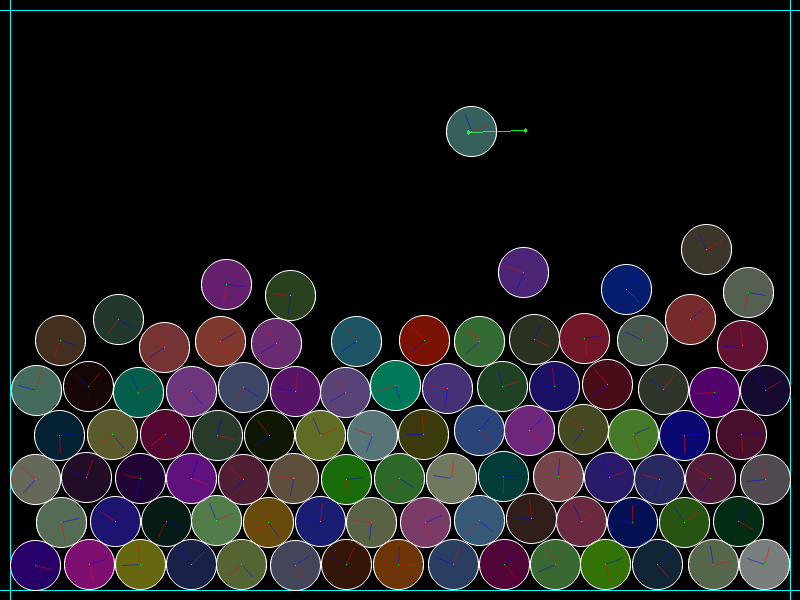

# Chipmunk-lib balls

This small program has been made with the libs [SDL2](https://www.libsdl.org/download-2.0.php), [SDL2_gfx](http://www.ferzkopp.net/wordpress/2016/01/02/sdl_gfx-sdl2_gfx/) and [Chipmunk](https://chipmunk-physics.net).

You're free to do whatever you want with it, as long as you you respect the EULA of these libraries.
It is just a code sample I made to try Chipmunk. Try different radii, different masses, mess around with it.

**Dependencies**

You just need to have SDL2 lib installed, Chipmunk lib and SDL2_gfx are already here.

**Installation**

Command line `make` and that's it.

**Commands**

Press <kbd>P</kbd> to increment the number of balls to add when you click, and <kbd>M</kbd> to decrement it.
You can right-click on a ball to create a Pivot Joint between the ball and the mouse coordinates (actually a point of the space updated with the mouse's coordinates).

Press <kbd>R</kbd> to clear the space and remove every ball.

You can change the `BALLS_AS_POINTS` variable to render points instead of SDL2_gfx circles.
